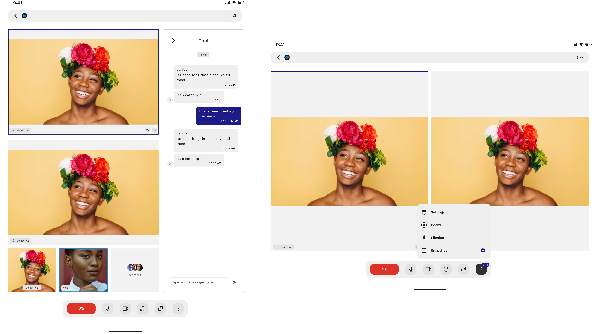

# Kaleyra Video Android SDK

**Kaleyra video** enables audio/video communication and collaboration from any platform and browser! Through its WebRTC architecture, it makes video communication simple and punctual.

---

. **[Overview](#overview)** .
**[Requirements](#requirements)** .
**[Features](#features)** .

---

# Overview

**Kaleyra Video Android SDK** makes it easy to add video conference and chat communication to mobile apps.

## Phone

## Tablet

## Glass

# Requirements

**Gradle 8.+**

**JDK 17**

**Kotlin v1.9.+**

**Java 1.8**

**Target API 34**

**Supported API level 21+ (Android 5.0 Lollipop).**

# Features

- Audio call
- Audio call upgradable to video call
- Video call
- Chat
- Collaborative whiteboard
- File sharing in call
- Screen sharing in call:
    - App only
    - System wide
- Call Recording
- Virtual Background
- External Camera

# Documentation
[KDoc](https://kaleyravideo.github.io/VideoAndroidSDK/)

# Introduction
[Home](https://github.com/KaleyraVideo/VideoAndroidSDK/wiki/Home)

# Basic Integration
### Project Setup
   * [Get your credentials](https://github.com/KaleyraVideo/VideoAndroidSDK/wiki/Setup#get-your-credentials)
   * [Add dependency](https://github.com/KaleyraVideo/VideoAndroidSDK/wiki/Setup#add-dependency)
   * [Android Studio Project Setup](https://github.com/KaleyraVideo/VideoAndroidSDK/wiki/Setup#android-studio-project-setup)
### Quick start guide | Use Cases
   * [Receive calls (outbound calls)](https://github.com/KaleyraVideo/VideoAndroidSDK/wiki/Receive-calls-(outbound-calls))  
     - [Handle Push Notifications](https://github.com/KaleyraVideo/VideoAndroidSDK/wiki/Handle-Push-Notifications) 
   * [Place calls (inbound calls)](https://github.com/KaleyraVideo/VideoAndroidSDK/wiki/Place-calls-(inbound-calls))
   * [Call links](https://github.com/KaleyraVideo/VideoAndroidSDK/wiki/Handle-Links)
 
[User Details Display Customization](https://github.com/KaleyraVideo/VideoAndroidSDK/wiki/Customize-user-details#user-details-provider)

# Advanced topics
### KaleyraVideo Lifecycle
   * [Configure](https://github.com/KaleyraVideo/VideoAndroidSDK/wiki/Use-KaleyraVideoSDK#configure-kaleyravideo-sdk)
   * [Observe events](https://github.com/KaleyraVideo/VideoAndroidSDK/wiki/KaleyraVideoSDK-Observers)
   * [Connect](https://github.com/KaleyraVideo/VideoAndroidSDK/wiki/Use-KaleyraVideoSDK#connect-kaleyravideo-sdk)
   * [Disconnect](https://github.com/KaleyraVideo/VideoAndroidSDK/wiki/Use-KaleyraVideoSDK#disconnect-kaleyravideo-sdk)
   * [Reset](https://github.com/KaleyraVideo/VideoAndroidSDK/wiki/Use-KaleyraVideoSDK#reset-kaleyravideo-sdk)
   * [Delete user data](https://github.com/KaleyraVideo/VideoAndroidSDK/wiki/Use-KaleyraVideoSDK#clear-all-user-data)

### KaleyraVideo debug&release
   * [Logging](https://github.com/KaleyraVideo/VideoAndroidSDK/wiki/Logging)
   * [Proguard](https://github.com/KaleyraVideo/VideoAndroidSDK/wiki/Proguard)

### Conference - Call
   * [Get current call](https://github.com/KaleyraVideo/VideoAndroidSDK/wiki/Call-Flows#get-current-call)
   * [Update display actions](https://github.com/KaleyraVideo/VideoAndroidSDK/wiki/Call-Flows#update-displayed-call-actions)
   * [Observe events](https://github.com/KaleyraVideo/VideoAndroidSDK/wiki/Call-Flows#update-displayed-call-actions)
   * [Change display mode](https://github.com/KaleyraVideo/VideoAndroidSDK/wiki/Call-Flows#call-ui-display-mode)
   * [Android Connection Service](https://github.com/KaleyraVideo/VideoAndroidSDK/wiki/Android-Connection-Service)

### Conversation - Chat
   * [Get active chats](https://github.com/KaleyraVideo/VideoAndroidSDK/wiki/Chat#get-active-chats)
   * [Place a chat](https://github.com/KaleyraVideo/VideoAndroidSDK/wiki/Chat)
   * [Update display actions](https://github.com/KaleyraVideo/VideoAndroidSDK/wiki/Chat#update-displayed-chat-actions)
   * [Observe events](https://github.com/KaleyraVideo/VideoAndroidSDK/wiki/Chat#listen-for-chat-eventserrors)

# Extensions

[USB Camera](https://github.com/KaleyraVideo/VideoAndroidSDK/wiki/USB-Camera)

[Virtual Backgrounds](https://github.com/KaleyraVideo/VideoAndroidSDK/wiki/Virtual-Backgrounds)

# Theme Customization

🎨  &nbsp; [Logo&Colors](https://github.com/KaleyraVideo/VideoAndroidSDK/wiki/Theme-Customization)

# Migrations

[Upgrade to v4.+](https://github.com/KaleyraVideo/VideoAndroidSDK/wiki/Upgrade-to-Kaleyra-Video-SDK-v4.x)

# Other
[Pricing](https://github.com/KaleyraVideo/VideoAndroidSDK/wiki/Pricing)

[Troubleshooting](https://github.com/KaleyraVideo/VideoAndroidSDK/wiki/Troubleshooting)
