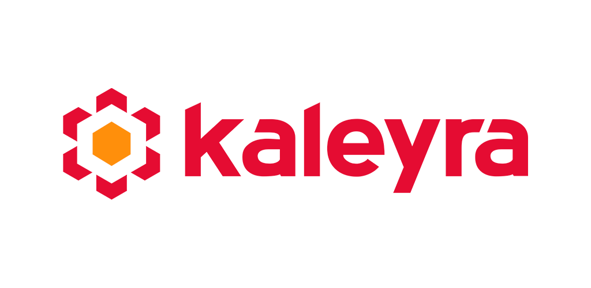
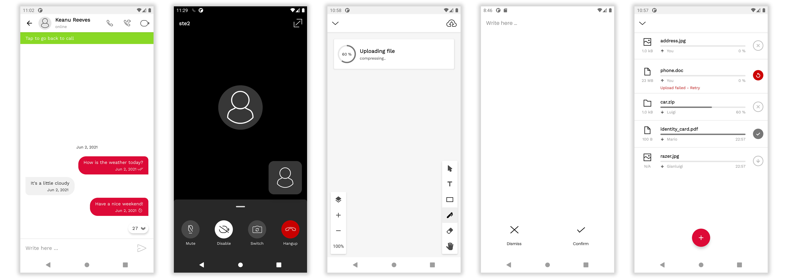
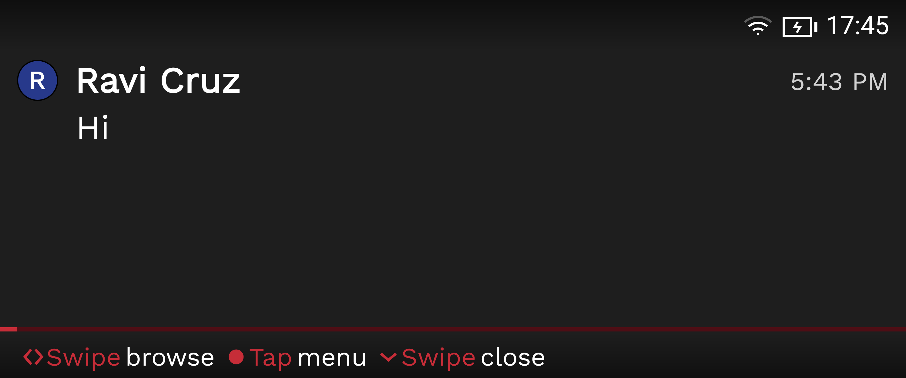

# Kaleyra Video Android SDK

<p align="center">

</p>

[ ](https://maven.bandyer.com/index.html#releases/com/kaleyra/video-sdk-bom/)[](https://github.com/KaleyraVideo/VideoAndroidSDK/actions/workflows/android.yml)

**Kaleyra video** enables audio/video communication and collaboration from any platform and browser! Through its WebRTC architecture, it makes video communication simple and punctual.

---

. **[Overview](#overview)** .
**[Requirements](#requirements)** .
**[Features](#features)** .

---

## Overview

**Kaleyra Video Android SDK** makes it easy to add video conference and chat communication to mobile apps.

**Even though this sdk encloses strongly the UI/UX, it is fully styleable through default Android style system.**

### Phone UI


### Glass UI


## Requirements

**Gradle 8.+**

**JDK 17**

**Kotlin v1.9.+**

**Java 1.8**

**Target API 33**

**Supported API level 21+ (Android 5.0 Lollipop).**


```java
android {

   defaultConfig {
        minSdkVersion 21
        targetSdkVersion 33
        [...]
   }
   
    compileOptions {
        sourceCompatibility JavaVersion.VERSION_1_8
        targetCompatibility JavaVersion.VERSION_1_8
    }

    composeOptions {
        kotlinCompilerExtensionVersion 1.5.3  // or newer
    }
    
    [...]
}

```

## Features

- Audio call
- Audio call upgradable to video call
- Video call
- Chat
- Collaborative whiteboard
- File sharing in call
- Screen sharing in call:
    - App only
    - System wide
- Call Recording
- Virtual Background
- External Camera

## Documentation

### Introduction
[Home](https://github.com/KaleyraVideo/VideoAndroidSDK/wiki/Home)

### Integration
1. [Project Setup](https://github.com/KaleyraVideo/VideoAndroidSDK/wiki/Setup)
   - [Get your credentials](https://github.com/KaleyraVideo/VideoAndroidSDK/wiki/Setup#get-your-credentials)
   - [Add dependency](https://github.com/KaleyraVideo/VideoAndroidSDK/wiki/Setup#add-dependency)
   - [Android Studio Project Setup](https://github.com/KaleyraVideo/VideoAndroidSDK/wiki/Setup#android-studio-project-setup)
1. [Quick start guide | Use Cases](https://github.com/KaleyraVideo/VideoAndroidSDK/wiki/Quick-start-guide-%7C-Use-Cases)
    - [Receive calls (outbound calls)](https://github.com/KaleyraVideo/VideoAndroidSDK/wiki/Quick-start-guide-%7C-Use-Cases#receive-calls-outbound-calls)
    - [Place calls (inbound calls)](https://github.com/KaleyraVideo/VideoAndroidSDK/wiki/Quick-start-guide-%7C-Use-Cases#place-calls-inbound-calls)
    - [Call links](https://github.com/KaleyraVideo/VideoAndroidSDK/wiki/Quick-start-guide-%7C-Use-Cases#call-links)  

### Advanced integration
1. [Configure KaleyraVideo](https://github.com/KaleyraVideo/VideoAndroidSDK/wiki/Configure-KaleyraVideoSDK#configure-kaleyravideo-sdk)
1. [Use KaleyraVideo](https://github.com/KaleyraVideo/VideoAndroidSDK/wiki/Connect-KaleyraVideoSDK)
    - [Connect](https://github.com/KaleyraVideo/VideoAndroidSDK/wiki/Connect-KaleyraVideoSDK#connect-kaleyravideo-sdk)
    - [Disconnect](https://github.com/KaleyraVideo/VideoAndroidSDK/wiki/Connect-KaleyraVideoSDK#disconnect-kaleyravideo-sdk)
    - [Reset](https://github.com/KaleyraVideo/VideoAndroidSDK/wiki/Connect-KaleyraVideoSDK#reset-kaleyravideo-sdk)
    - [Delete user data](https://github.com/KaleyraVideo/VideoAndroidSDK/wiki/Connect-KaleyraVideoSDK#clear-all-user-data)
1. [Start a Call](https://github.com/KaleyraVideo/VideoAndroidSDK/wiki/Start-a-call)
1. [Observe Call Events](https://github.com/KaleyraVideo/VideoAndroidSDK/wiki/Observe-call-events)
1. [Start a Chat](https://github.com/KaleyraVideo/VideoAndroidSDK/wiki/Start-a-chat)
1. [Observe Chat Events](https://github.com/KaleyraVideo/VideoAndroidSDK/wiki/Observe-Chat-Events)
1. [Handle Push Notifications](https://github.com/KaleyraVideo/VideoAndroidSDK/wiki/Handle-Push-Notifications)
1. [Handle Call Links](https://github.com/KaleyraVideo/VideoAndroidSDK/wiki/Handle-Links)


### User Details Display Customization
[User Details Provider](https://github.com/KaleyraVideo/VideoAndroidSDK/wiki/Customize-user-details#user-details-provider)


### Advanced topics
[Logging](https://github.com/KaleyraVideo/VideoAndroidSDK/wiki/Logging)

[KaleyraVideo State&Synchronization Observer](https://github.com/KaleyraVideo/VideoAndroidSDK/wiki/KaleyraVideoSDK-Observers)

[Call UI Display Mode](https://github.com/KaleyraVideo/VideoAndroidSDK/wiki/Call-UI-Display-Mode)

[Android Connection Service](https://github.com/KaleyraVideo/VideoAndroidSDK/wiki/Android-Connection-Service)

[Proguard](https://github.com/KaleyraVideo/VideoAndroidSDK/wiki/Proguard)

### Extensions

[USB Camera](https://github.com/KaleyraVideo/VideoAndroidSDK/wiki/USB-Camera)

[Virtual Backgrounds](https://github.com/KaleyraVideo/VideoAndroidSDK/wiki/Virtual-Backgrounds)

### Theme Customization

🎨  &nbsp; [Logo&Colors](https://github.com/KaleyraVideo/VideoAndroidSDK/wiki/Theme-Customization)

### Migrations

[Upgrade to v4.+](https://github.com/KaleyraVideo/VideoAndroidSDK/wiki/Upgrade-to-Kaleyra-Video-SDK-v4.x)

### Other
[Pricing](https://github.com/KaleyraVideo/VideoAndroidSDK/wiki/Pricing)

[Troubleshooting](https://github.com/KaleyraVideo/VideoAndroidSDK/wiki/Troubleshooting)
